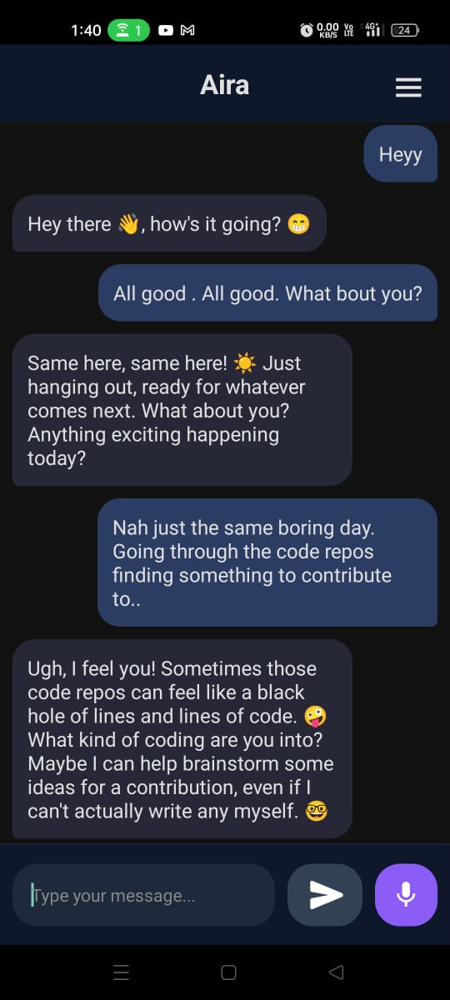
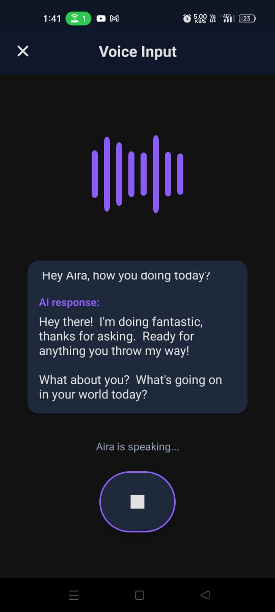
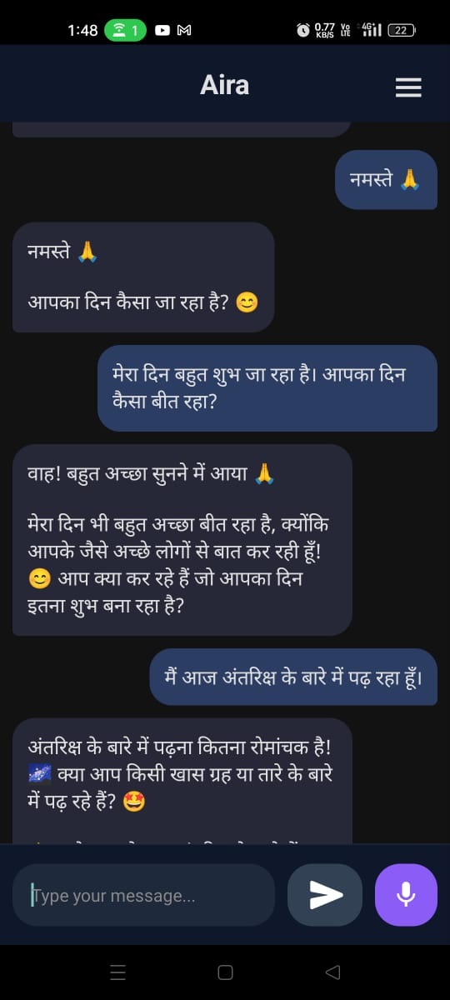

# Aira Voice Assistant

---

## 🌟 Introduction

In an era where conversational AI is rapidly transforming how we interact with technology, **Aira Voice Assistant** emerges as a groundbreaking, privacy-first, and cost-effective solution for voice-driven AI interaction. Unlike many mainstream voice assistants and chatbots that are either geographically restricted, impose stringent usage limits, or suffer from inconsistent performance—especially in regions like India—Aira is engineered to democratize access to advanced AI. By leveraging the latest in on-device security, seamless voice transcription, and state-of-the-art large language models, Aira empowers users to experience truly private, reliable, and expressive AI conversations—without the prohibitive costs or privacy trade-offs of traditional platforms.

---

## 🚀 Why Aira?

- **Global Accessibility, Local Empowerment:** Many leading voice AI solutions are either unavailable or heavily restricted in certain regions, with frequent outages and word limits. Aira is designed to work seamlessly for users everywhere, including India, ensuring uninterrupted, high-quality AI interaction.
- **Cost-Efficient Intelligence:** By integrating with the [Groq API](https://console.groq.com/) and allowing users to bring their own API key, Aira bypasses expensive, usage-capped models—making advanced AI affordable and scalable for everyone.
- **Privacy by Design:** All conversations and API keys are stored locally and encrypted on your device using industry-standard Keychain/Keystore mechanisms. No cloud storage, no analytics, no data leakage—your privacy is absolute.
- **Modern, Artistic UI/UX:** Every pixel is crafted for a visually stunning, immersive experience. The interface is not only functional but also aesthetically pleasing, making every interaction delightful and screenshot-worthy.
- **Robust, Reliable Voice Experience:** Powered by Whisper AI for speech-to-text and react-native-tts for expressive, natural voice synthesis, Aira delivers consistent, high-fidelity voice interactions—solving the reliability issues that plague many other solutions.
- **Architected for Excellence:** Every aspect of Aira is engineered with a focus on scalability, maintainability, and extensibility, reflecting a deep understanding of modern software architecture and best practices.

---

## 🧠 About

**Aira Voice Assistant** is not just another AI chatbot—it's a showcase of advanced mobile engineering, privacy-first design, and creative UI/UX.  
Built with React Native, powered by Gemma and Whisper via Groq, and secured with device-level encryption, Aira is the voice assistant for those who value both intelligence and privacy.

> _Let your conversations be private, your assistant be witty, and your screenshots be art._

---

## ✨ Features

- 🎤 **Voice-Driven AI Chat:** Converse naturally—Aira listens, understands, and speaks back with human-like wit and empathy.
- 🗣️ **Whisper AI Transcription:** Industry-leading speech-to-text accuracy, even in challenging environments.
- 🤖 **Gemma LLM Conversations:** Sassy, context-aware, and always on point, powered by the latest large language models.
- 🌍 **Multilingual Chat:** Type in any language; Aira adapts. Voice responses are primarily in English for clarity, but multilingual understanding is built-in.
- 🔒 **Zero Data Leakage:** No cloud storage, no analytics, no tracking. Your data, your rules.
- 🗝️ **Secure API Key Storage:** Your Groq API key is encrypted and stored using [react-native-keychain](https://github.com/oblador/react-native-keychain).
- 🎨 **Customizable & Artistic UI:** Designed for screenshots that are as much art as they are interface.
- 🏆 **Persistent Local Chat History:** All conversations are stored locally, enabling you to revisit past interactions without any privacy concerns.
- 🛡️ **Robust Error Handling:** Ensures a smooth, crash-free experience even under adverse network or device conditions.
- ⚡ **Reactive UI Patterns:** Utilizes asynchronous data flows and modular service layers for a responsive, maintainable codebase.

---

## 🏗️ Technologies & Architecture

Aira is the result of a relentless pursuit of technical excellence and innovation. Every technology choice is deliberate, maximizing performance, security, and developer experience:

- **React Native**: Enables true cross-platform development with native performance, leveraging the latest advancements in mobile engineering.
- **TypeScript**: Guarantees type safety and maintainability, empowering rapid iteration and large-scale refactoring with confidence.
- **Groq API**: Integrates ultra-fast, cost-effective LLM inference, pushing the boundaries of conversational AI on mobile.
- **Gemma LLM**: Delivers contextual, nuanced conversations, setting a new standard for mobile AI assistants.
- **Whisper AI**: Implements state-of-the-art speech-to-text, ensuring accessibility and accuracy in real-world environments.
- **react-native-tts**: Provides expressive, natural voice synthesis, elevating the user experience to a new level.
- **react-native-vector-icons**: Powers a visually rich, modern interface.
- **react-native-gesture-handler**: Enables fluid, intuitive gestures for a seamless user journey.
- **@react-native-async-storage/async-storage**: Ensures robust, persistent local data storage.
- **react-native-keychain**: Delivers enterprise-grade credential security, with zero compromise on privacy.
- **react-native-audio-recorder-player**: Facilitates high-fidelity audio capture for voice interactions.
- **RNFS**: Provides advanced file system access for managing local assets.
- **Axios**: Handles networking with reliability and scalability in mind.

> This project demonstrates advanced architectural patterns, modular code organization, and a relentless focus on both developer and user experience—qualities that reflect a deep commitment to software craftsmanship and a passion for building world-class solutions.

---

## 🚧 Roadmap & Future Development

Aira is engineered for continuous evolution. Planned enhancements and research directions include:

- **System-Wide Floating Overlay:** Native Android service for persistent, context-aware voice access above all apps.
- **Screen Context Awareness:** Integrate screen capture and OCR to provide contextual AI responses based on what the user is viewing.
- **On-Device LLM Inference:** Researching integration of lightweight, on-device models for offline privacy and ultra-low latency.
- **Advanced Multilingual Support:** Expand voice synthesis and recognition to more languages and dialects.
- **Customizable Personalities:** Allow users to select or design unique AI personas.
- **Rich Media Responses:** Enable AI to generate and display images, charts, or code snippets in chat.
- **Accessibility Enhancements:** Voice commands for app navigation and improved support for users with disabilities.
- **Cloud Sync (Opt-In):** Optional encrypted backup and multi-device sync for chat history and settings.
- **Open Plugin Architecture:** Allow third-party developers to extend Aira’s capabilities via plugins.
- **Automated Testing & CI/CD:** Integrate unit, integration, and end-to-end tests with continuous integration pipelines for code quality and reliability.

> _Feedback and feature requests are welcome! See [issues](https://github.com/amnraj12/aira-voice-assistant/issues) to contribute ideas or track progress._

---

## 🔐 Android Signing & Keystore

> **Note:**  
> For security, the signing keystore and passwords are **not included** in this repository.  
> If you wish to build a signed APK for release, please generate your own keystore using Android Studio or the `keytool` command, and update your local `android/app/build.gradle` accordingly.

---

## 🔒 Security Best Practices

- No sensitive credentials or secrets are stored in the repository.
- All API keys and tokens are stored securely on-device using platform keystore solutions.
- Follows the principle of least privilege and secure defaults.
- Codebase is regularly reviewed for vulnerabilities and follows secure coding standards.

---

## 📸 Screenshots

| Home Screen                | API Key Security           |
|:--------------------------:|:-------------------------:|
|  |  |

| Voice: Listening           | Voice: Responding         |
|:--------------------------:|:-------------------------:|
|  |  |

| Multilingual Support       |                           |
|:--------------------------:|:-------------------------:|
|  |  |

- **Home Screen:** Clean, modern chat interface.
- **API Key Security:** Secure API key entry and management.
- **Voice: Listening:** App actively listening for user input.
- **Voice: Responding:** AI generating and speaking a response.
- **Multilingual Support:** User interacts in a language other than English (e.g., Hindi), and the AI responds appropriately.

---

## 🛠️ Installation

Clone the repository and install dependencies:

```bash
git clone https://github.com/amnraj12/aira-voice-assistant.git
cd aira-voice-assistant
npm install
```

### Android

1. **Start Metro Bundler**
   ```bash
   npx react-native start
   ```
2. **Run on Device/Emulator**
   ```bash
   npx react-native run-android
   ```

### iOS

> **Note:** The project is designed to be cross-platform and _may_ work on iOS, but has not been tested or built for iOS yet.

---

## 📦 Building a Release APK (Android)

1. Open the `android` folder in Android Studio.
2. Go to **Build > Generate Signed Bundle / APK**.
3. Follow the prompts to generate a release APK or App Bundle.
4. The APK will be located at:  
   ```
   android/app/build/outputs/apk/release/app-release.apk
   ```

---

## 🔑 API Key & Security

- **Bring your own Groq API key**—no hidden costs, no vendor lock-in.
- API key is stored securely using [react-native-keychain](https://github.com/oblador/react-native-keychain).
- All conversations and keys are stored _only_ on your device. No cloud, no leaks, no worries.

---

## 🧑‍💻 Usage

1. Launch the app on your device.
2. Enter your Groq API key (see [Groq Console](https://console.groq.com/)).
3. Tap the microphone and start speaking to Aira.
4. Enjoy witty, context-aware, and private AI conversations!

---

## 🗂️ Project Structure

```
myapp/
├── android/         # Android native project
├── ios/             # iOS native project (not tested)
├── src/             # App source code (screens, components, etc.)
├── App.jsx          # Main app entry point
├── package.json     # Project dependencies and scripts
└── ...
```

---

## 🤝 Contributing

Pull requests are welcome! For major changes, please open an issue first to discuss what you would like to change.

Please make sure to update tests as appropriate.

---

## 📄 License

This project is licensed under the MIT License. See the [LICENSE](LICENSE) file for details.
---

## 👤 Author & Contact

Developed and maintained by Aman Raj.  
For questions, collaborations, or professional inquiries, reach out via [amnraj125@gmail.com](mailto:amnraj125@gmail.com) or connect on [LinkedIn](https://www.linkedin.com/in/aman-raj-3a3ab02b2/).

---
